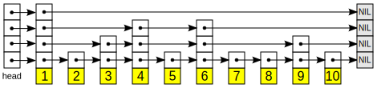

# List of Data Structures

## Table of Contents

- [List of Data Structures](#list-of-data-structures)
  - [Table of Contents](#table-of-contents)
  - [Preface](#preface)
  - [Data Types](#data-types)
    - [Primitive Types](#primitive-types)
    - [Composite or Non-Primitive Types](#composite-or-non-primitive-types)
    - [Abstract Data Types](#abstract-data-types)
  - [Linear Data Structures](#linear-data-structures)
    - [Arrays](#arrays)
    - [Lists](#lists)
  - [Tree Data Structures](#tree-data-structures)
    - [Binary Trees](#binary-trees)
    - [Balanced Trees (B-trees)](#balanced-trees-b-trees)
    - [Heaps](#heaps)
    - [Bit-slice Trees](#bit-slice-trees)
    - [Multi-way Trees](#multi-way-trees)
    - [Space-partitioning Trees](#space-partitioning-trees)
    - [Application-specific Trees](#application-specific-trees)

## Preface

This is a cheat-sheet for data structures. I made this for my personal curiosity and usage. I don't know if it's useful for anyone else. All of the data structure and order is taken from [this](https://en.wikipedia.org/wiki/List_of_data_structures) Wikipedia article about data structures. 

I added some short definitions about all of them. *I want to add images and code sniplets* to advance the intelligibility. I did this to see all data structures in one place and quickly look-up.

Most of the data structures and algorithms textbooks cover basic data structures and their implementations. Also some books cover great amount of them in-depth. Here are my favorites:

- **Algorithms** by *Robert Sedgewick*, *Kevin Wayne*
- **Algorithms in a Nutshell** by *George T. Heineman*, *Gary Pollice*, *Stanley Selkow*
- **Grokking Algorithms** by *Aditya Bhargava*
- **Introduction to Algorithms** by *Thomas H. Cormen*, *Charles E. Leiserson*, *Ronald L. Rivest*, *Clifford Stein*
- **The Algorithm Design Manual** by *Steven S. Skiena*
- **The Art of Computer Programming** by *Donald E. Knuth*
- **Advanced Algorithms and Data Structures** by *Marcello La Rocca*
- **Advanced Data Structures** by *Peter Brass*

I hope you like these books and find them useful.

Also i want to implement all of these data structures in several languages. But [The Algorithms](https://the-algorithms.com/) already covers all of them. So my purpose is to implement them for my own development. 

I hope you find this cheat-sheet useful. Feel free to correct my mistakes if you find any and add missing information.

## Data Types

### Primitive Types

- **Boolean**:

    Boolean is a data type that can only be either `true` or `false`.
    
    Booleans are usually used in logical expressions, such as conditions in if-then statements and for loops.

- **Character**:

    Character, char for short, is a data type that can only be a single character. It is usually used to represent a single character in a string. For example, the character `'a'` is a single character string that contains the letter `'a'`. The character `'a'` is also a single character string.

- **Floating-Point Numbers**:

    Floating-point data types are used to store real numbers with a decimal point.

    There are two types of floating-point numbers:
    - **Single-precision**:
        - `float`: 32-bit floating-point number.
        
        Single-precision floating-point numbers are 32-bit floating-point numbers.
        
    - **Double-precision**:
        - `double`: 64-bit floating-point number.

        Double-precision floating-point numbers are 64-bit floating-point numbers.
    
    Single precision floating-point numbers are used when the precision of the number is not important and there is a need for fast calculations.

    On the other hand, double precision floating-point numbers are used when the precision of the number is important and there is a need for accurate calculations.

- **Fixed-Point Numbers**:

    Fixed-point data types are used to store real numbers with a fixed number of decimal places.

    A fixed-point number is a data type that can be used to store any real number, but only in a limited range.

- **Integer**:

    Integer is a data type that can only be a whole number.
    
    Integers are usually used to store the number of items in a collection, or the number of times a loop will be executed.

- **Pointer (Reference)**:

    Pointer (reference) is a data type that can be used to store a memory address.
    
    A memory address is a number that represents the location of a memory location in memory.

- **Enumerated**:

    Enumerated is a data type that can only be one of a set of predefined values.
    
    Enumerated data types are used to store a value that is one of a set of predefined values.
    
    For example, the enumerated data type `Days_of_the_Week` can only be one of the seven days of the week: `'Monday'`, `'Tuesday'`, `'Wednesday'`, `'Thursday'`, `'Friday'`, `'Saturday'`, and `'Sunday'`.

- **Date & Time**:

    Date and time data type is a data type that stores date and time values.

    The date and time data type is used to store a range of values from January 1, 1970 to December 31, 9999.

    It also has the ability to store fractional seconds for the end of each day.

### Composite or Non-Primitive Types

- **Array**:

    An array is a data type that can store a collection of data.
    
    Array stores the date in an ordered sequence. Each datum in the array is called an element and each element has a unique index.

    The index of an element in an array is called its position.

    The index of the first element in an array could be 0 or 1, and the type of the elements must ot mustn't be the same based on the language.

    Also array elements stored in the memory in **contiguous memory locations**. This means that the elements are stored in order and there is no gap between them.
    
    
    
    An array could be `static` or `dynamic`. *Static* arrays are created at compile time and *dynamic* arrays are created at run time. Difference between *static* and *dynamic* arrays is that *static* arrays could store fixed number of elements and *dynamic* arrays could store unlimited number of elements theoroticly. But each time the *dynamic* array reached its maximum capacity, a new memory location is allocated to store the new elements and all the old elements are copied to the new memory location.

- **Structure (Record)**:

    A record, structure or struct for short is a collection of data that is used to store data. Record is a collection of fields, possibly of different data types, typically in a fixed number and sequence.

    The fields of a record are called members and the members are accessed by name.

    Size of the memory block that stores the record is the **sum of the sizes of all the members**.

- **Union**:

    A union is a value that may have any of several representations or formats within the same position in memory.

    The union data type is used to store data that can be of different types. 

    A union can be pictured as a chunk of memory that is used to store variables of different data types. 
    
    Once a new value is assigned to a field, the existing data is overwritten with the new data. 
    
    The memory area storing the value has no intrinsic type, but the value can be treated as one of several abstract data types, having the type of the value that was last written to the memory area.

    Size of the memory block that stores the union is the size of the **largest member**.

### Abstract Data Types

- **Container**:

    A container or collection is a data type that can store a collection of data. 

    - **Linear Containers**:
        - `List`
        - `Stack`
        - `Queue`
        - `Priority Queue`
        - `Double-Ended Queue`
        - `Double-Ended Priority Queue`
    
    - **Associative Containers**:
        - `Set`
        - `Multi-Set (Bag)`
        - `Map (Associative Array)`

- **List**:

    List or sequence is a dynamic data type that can store a collection of data in a linear order.

    The elements of a list are called nodes and the nodes are linked together to form a chain.

    The first node in the list is called the head and the last node in the list is called the tail.

    A list could be used like an `array` but the main differences between them are the following:
    - The elements of a list are **not stored** in *contiguous memory locations*.
    - List is not fixed in size.
    - The elements in the list can be added and removed at any position.

- **Tuple**:

    Tuple is a finite collection of data that is used to store a collection of data in a fixed number and sequence.

- **Map (Associative Array)**:

    A map, associative array, symbol table, or dictionary is a data type that can store a collection of data in a key-value pair.

    The key is used to access the value and each **key has to be unique**.

    Also each key can **have only one value**.

- **Multimap**:

    A Multimap, multihash, multidict or multidictionary is a data type that can store a collection of data in a key-value pair.

    It is a generalization of the map data type. With multimap **more than one value** may be associated with and returned for a given key.

    The key is used to access the value or values and each key has to be unique.

- **Set**:

    A set is a data type that can store a collection of data in a unordered sequence that does **not allow duplicates**.

    Some sets are designed to be *static* or *frozen* and cannot be modified at runtime. Frozen sets are also called *immutable* sets and they only allow querying operations.

    Other types of sets are called *dynamic* or *mutable* sets and they allow adding and removing elements.

- **Multiset (Bag)**:

    A multiset or bag is a data type that can store a collection of data in a unordered sequence, like a set, that **allows duplicates**.

- **Stack**:

    A stack is a data type that can store a collection of data in a linear order.

    It is a list-like structure in which elements may be inserted or removed from only one end.

    Stack is a **LIFO** *(Last In First Out)* data structure. The last element added to the stack is the first element to be removed.

    It has 2 main and 1 additional operations:
    - **`Push`**: Adds an element to the top of the stack.
    - **`Pop`**: Removes the top element from the stack.
    - **`Peek`**: Returns the top element from the stack.

- **Queue**:

    A queue is a data type that can store a collection of data in a linear order.

    It is a list-like structure in which elements are inserted only at one end, and removed only from the other one end.

    Queue is a **FIFO** *(First In First Out)* data structure. The first element added to the queue is the first element to be removed.

    The beginning of the queue is called the *head* and the end of the queue is called *back*, *tail* or *rear*.

- **Double-ended queue**:

    A double-ended queue or *deque* is a data type that can store a collection of data in a linear order.

    It is a generalization of the queue data type. It allows adding and removing elements from both ends of the queue.

- **Graph**:

    A graph is a data type that used to show the relationship between two or more objects. Graph is collection of nodes that have data and are connected to other nodes.

    A graph consists of a finite set of vertices, *nodes*, together with a set of unordered pairs of these vertices, *edges*, for an undirected graph or a set of ordered pairs for a directed graph.

    A graph is defined with its vertices and edges; 
    $$ G = (V, E) $$
    where V is the set of vertices and E is the set of edges.

## Linear Data Structures

A data structure said to be linear if its elements are stored in a sequential order.

### Arrays

- **Array**:

    Go to the [Array](#array) section.

- **Bit Array**:

    A bit array, bit map, bit set, bit string or bit vector is an array that compactly stores a set of bits.

- **Bit Field**:

    A bit field is an array of bits that each bit or group of bits has a specific purpose. A bit field is used to store data in a compact way.

    The most known bit field is the flag registers in the CPU.

- **Bitboard**:
  
    A bitboard is a special type of bit array that used in games like chess. Bitboard represents the game board where each bit represents a square or a piece. This allows parallel bitwise operations to set or query the game state, or determine moves or plays in the game.

- **Bitmap**:

    A bitmap is a bit array that is used to store a set of bits. It is a representation in which each item corresponds to one or more bits of information, especially the information used to control the display of a computer screen.

- **Circular Buffer**:
  
    A circular buffer, circular queue, cyclic buffer or ring buffer is uses a single, fixed-size buffer(temporary memory area) as if it were connected end-to-end.

    It is a **FIFO** data structure that is full when the last element is inserted and the first element is removed.

- **Control Table**:

    A control table is a data structure that is used to control flow of programs.

- **Dope Vector**:

    Dope vector is a data structure to store information about a set of objects. It is commonly used by compilers to store metadata about the objects such as arrays like length, type and capacity.

    Dope vectors help compilers to access the arrays with ease.

    Different controls such as out of bound and insertion type made thanks to dope vectors.

- **Dynamic Array**:

    Dynamic array, growable array, resizable array, dynamic table, mutable array, or array list. A dynamic array data structure is a data structure that allows the elements of the structure to be dynamically allocated and deallocated. This allows the structure to be used as an array, without the need to allocate and deallocate memory blocks.

- **Gap Buffer**:

    A gap buffer is a dynamic array that allows efficient insertion and deletion operations at clustered near the same location.

    Gap buffers are mostly used in text editors; because most of the time changes are made near the same location.

- **Hashed Array Tree**:

    A hashed array tree (HAT) is a dynamic data structure that uses a hashing algorithm to organize data in a tree-like structure. The data is organized into buckets, and each bucket is hashed using the hashing algorithm. The buckets are then linked together using the hash values of the buckets. The tree structure is then traversed to retrieve the data in the buckets.

- **Lookup Table**:

    A lookup table (LUT) is an array that replaces runtime computation with a simpler array indexing operation. It is used to store data in a compact way.

- **Matrix**:

    A matrix is a data structure that is used to store data in a two-dimensional array.

- **Parallel Array**:

    Parallel arrays is a form of implicit data structure that uses multiple arrays to represent a singular array of records. It is used to store data in a compact way. It is a primitive way to represent 2-dimensional table-like data.

- **Sorted Array**:

    A sorted array is an array data structure that is used to store data in a sorted order. 

- **Sparse Matrix**:

    A sparse matrix or sparse array is an array data structure which most of it's elements are zero.

- **Iliffe Vector**:

    An lliffe vector data structure is a two-dimensional array of integers, typically used for storing multi-dimensional vectors. The structure is named after its creator, John L. Liffe.

- **Variable-length Array**:

    A variable-length, variable-sized or runtime-sized, array is a data structure whose size is determined at runtime.

### Lists

- **Linked List**

    Linked list data structure is a linear data structure as like an array. But the main difference is that the elements are not stored in a contiguous block of memory. Instead, each element is stored as a separate node. Each node has capability to store data and a memory location(reference or pointer) that points to the next node.
    With this way a linear order is maintained.

    Linked list ara dynamic data structures because of their nature. Their size is not fixed. Theoretically, the size of a linked list can be infinite.

    The first node is pointed to by the *head* and the last node is pointed to by the *tail* or *rear*.

    <figure>
    
    <figcaption align="center">
    <strong>Singly-linked list</strong>
    </figcaption>
    </figure>

- **Doubly Linked List**

    A doubly linked list is a data structure that allows two nodes to be linked together by a pointer, called a head pointer. Nodes at the front of the list are called the head node and nodes at the back are called the tail node. The pointer at the head of the list points to the next node in the list, and the pointer at the tail of the list points to the previous node in the list.

    To add a new node to the list, we first create a pointer to the new node. We then set the head pointer to point to the new node and the tail pointer to point to the node after the new node. The new node is now linked into the list. To remove a node from the list, we first find the head pointer. We then set the head pointer to point to the node after the node to be removed and the tail pointer to point to the node before the node to be removed. The node to be removed is now removed from the list.

    <figure>
    
    <figcaption align="center">
    <strong>Doubly-linked list</strong>
    </figcaption>
    </figure>

- **Array List**

    Also known as [Dynamic Array](#dynamic-array)

- **Association List**

    An association list or alist is a linked list type data structure that each node contains a key and a value like a dictionary. The association list is said to associate the value with the key.

    To find the value of a key, a sequential search is used. To add a new key-value pair, a new node is created and added to the end of the list. To remove a key-value pair, the node containing the key is removed from the list.

- **Self-organizing List**

    Self-organizing list is a linked list type data structure that changes it's order based on some self-organizing heuristic to improve average access time. 

    The aim of a self-organizing list is to improve efficiency of linear search by moving more frequently accessed items towards the head of the list.
    
    A self-organizing list achieves near constant time for element access in the best case. A self-organizing list uses a reorganizing algorithm to adapt to various query distributions at runtime.

- **Skip List**

    A skip list is a data structure that allows for fast search, insertion, and deletion of data in a sorted list. It is a type of linked list where each node contains a pointer to the next node in the list, as well as a pointer to the node that is two places ahead in the list. The skip list is a variation of the balanced binary search tree, which allows for O(log n) search time, where n is the number of nodes in the list.
    
    <figure>
    
    <figcaption align="center">
    <strong>Skip List</strong>
    </figcaption>
    </figure>

- **Unrolled Linked List**

    Unrolled linked list is a variation on the linked list which stores multiple elements in each node. 

- **VList**

    VList is a persistent data structure that combines the fast indexing of arrays with the easy extension linked lists.

    Like arrays, VLists have constant-time lookup on average and like linked lists they are persistent, and elements can be added to or removed from the front in constant time.

- **Conc-tree List**

    A conc-tree is a list type data structure that provides amortized constant time append and prepend operations. It is preferred on functional and data oriented programming.

- **Xor Linked List**

    An XOR linked list data structure is a type of data structure that allows two nodes to be linked together by an XOR operator. The nodes in the XOR linked list are linked together by a pointer. The first node in the list is linked to the second node by a pointer that is set to the bitwise XOR of the second node's data and the first node's data. The second node is linked to the first node by a pointer that is set to the bitwise XOR of the first node's data and the second node's data.

- **Zipper**

    A zipper is a technique of representing an aggregate data structure so that it is convenient for writing programs that traverse the structure arbitrarily and update its contents. The zipper technique is general in the sense that it can be adapted to lists, trees, and other recursively defined data structures. Zippers are efficient when making (functional) changes to a data structure, where a new, slightly changed, data structure is returned from an edit operation (instead of making a change in the current data structure)

- **Doubly Connected Edge List (Half-edge List)**

    The doubly connected edge list (DCEL), also known as half-edge data structure, is a data structure to represent an embedding of a planar graph in the plane, and polytopes in 3D. This data structure provides efficient(quantify) manipulation of the topological information associated with the objects in question (vertices, edges, faces).

- **Difference List**

    *TODO*

- **Free List**

    A free list is a data structure used in a scheme for dynamic memory allocation.

    It operates by connecting unallocated regions of memory together in a linked list, using the first word of each unallocated region as a pointer to the next.

    Free lists make the allocation and deallocation operations very simple.

    To allocate a region, one would simply remove a single region from the end of the free list and use it.

## Tree Data Structures

### Binary Trees

### Balanced Trees (B-trees)

### Heaps

### Bit-slice Trees

### Multi-way Trees

### Space-partitioning Trees

### Application-specific Trees